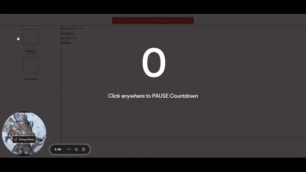

# code-challenge

## Build Setup

```bash
# install dependencies
$ yarn

# serve with hot reload at localhost:3000
$ yarn dev

# build for production and launch server
$ yarn build
$ yarn start

# generate static project
$ yarn generate
```

## description

- Basic drag and drop components
- History state saving for undo and redo actions with **stateshot** library
- I'm using localStorage for saving data

## result

[](https://www.loom.com/share/7c8dbd6a98214e81bb2abe6087b2339d)

## next update

- export import function
- using canvas for custom dynamic position
